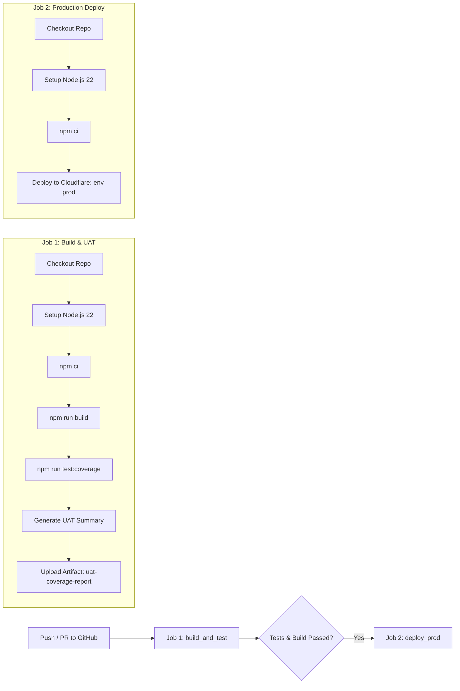

# Reporte de Pruebas UAT y Cobertura (Practice 7 - Pipeline with UAT)

**Proyecto:** Workflow with Cloudflare  
**Estudiante / Autor:** Diego Romo  
**Fecha:** 4 de Octubre de 2026  
**Entorno de Producción:** Cloudflare Workers (`hidden-water-7186-prod`)  

---

## 1. Resumen Ejecutivo

En esta práctica se implementó una suite completa de pruebas unitarias con reporte de cobertura para el Worker de Cloudflare conectado a una base de datos D1. Adicionalmente, se configuró un pipeline de Integración y Entrega Continua (CI/CD) con GitHub Actions dividido en **dos jobs**:

1. **Job 1 (`build_and_test`):** Construye el proyecto (`build`), ejecuta la suite de pruebas unitarias con generación de métricas de cobertura (`test:coverage`) y publica el reporte como un artefacto (`uat-coverage-report`).
2. **Job 2 (`deploy_prod`):** Depende del Job 1 (`needs: [build_and_test]`) y despliega la aplicación a un nuevo proyecto en Cloudflare Workers orientado a Producción (`Prod env`), utilizando el entorno `prod` configurado en `wrangler.jsonc`.

---

## 2. Métricas de Cobertura de Código (Coverage Report)

Las pruebas fueron ejecutadas con el motor de cobertura de **v8** a través de **Vitest**.

### Resultados obtenidos:

```text
 % Coverage report from v8
----------|---------|----------|---------|---------|-------------------
File      | % Stmts | % Branch | % Funcs | % Lines | Uncovered Line #s 
----------|---------|----------|---------|---------|-------------------
All files |     100 |      100 |     100 |     100 |                   
 index.ts |     100 |      100 |     100 |     100 |                   
----------|---------|----------|---------|---------|-------------------
```

- **Sentencias (Statements):** 100%
- **Ramas condicionales (Branch):** 100%
- **Funciones (Functions):** 100%
- **Líneas (Lines):** 100%

Los reportes interactivos se generan en el directorio `coverage/` en formatos:
- HTML (`coverage/index.html`)
- LCOV (`coverage/lcov.info`)
- JSON (`coverage/coverage-final.json`)

---

## 3. Matriz de Pruebas de Aceptación (UAT Test Cases)

| ID | Escenario / Endpoint | Método | Entrada / Parámetros | Resultado Esperado | Estado |
|:---|:---|:---:|:---|:---|:---:|
| **UAT-01** | Consultar lista de usuarios | `GET /` | Sin cuerpo | Código `200 OK`, arreglo JSON con usuarios | ✅ PASÓ |
| **UAT-02** | Crear usuario vía `/users` | `POST /users` | `{"name": "Ana Perez", "email": "ana@ejemplo.com"}` | Código `201 Created`, `{ success: true, user: {...} }` | ✅ PASÓ |
| **UAT-03** | Crear usuario vía `/` | `POST /` | `{"name": "Carlos Lopez", "email": "carlos@ejemplo.com"}` | Código `201 Created`, `{ success: true, user: {...} }` | ✅ PASÓ |
| **UAT-04** | Validación de campos faltantes | `POST /users` | Sin `email` o sin `name` | Código `400 Bad Request`, `{ error: "name and email are required" }` | ✅ PASÓ |
| **UAT-05** | Eliminar usuario existente | `DELETE /users/10` | ID numérico válido en ruta (`/users/10`) | Código `200 OK`, `{ success: true, message: "User 10 deleted" }` | ✅ PASÓ |
| **UAT-06** | Validación de ID no numérico | `DELETE /users/abc` | ID inválido en ruta (`/users/invalid-id`) | Código `400 Bad Request`, `{ error: "Invalid user id" }` | ✅ PASÓ |
| **UAT-07** | Manejo de excepciones en Base de Datos | `GET /` con fallo simulado | Error arrojado por base de datos D1 | Código `500 Internal Server Error`, `{ error: "Database connection failure" }` | ✅ PASÓ |

---

## 4. Arquitectura del Pipeline CI/CD (GitHub Actions)

El flujo de trabajo automatizado se definió en [`.github/workflows/deploy.yml`](.github/workflows/deploy.yml):



### Características destacadas del Workflow:
- **Artefactos UAT:** Sube automáticamente la carpeta `coverage/` como artefacto descargable con 14 días de retención.
- **Job Summary:** Agrega una tabla visual de UAT directamente en la pestaña del Action en GitHub (`$GITHUB_STEP_SUMMARY`).
- **Seguridad en Producción:** El Job 2 utiliza la directiva `needs: [build_and_test]`, impidiendo cualquier despliegue a producción si alguna prueba o validación falla.
- **Multi-Entorno en Cloudflare:** Se utiliza la directiva `environment: 'prod'` vinculada a la configuración `env.prod` en `wrangler.jsonc` para crear y desplegar el nuevo proyecto independiente (`hidden-water-7186-prod`).

---

## 5. Configuración de Entornos Cloudflare (`wrangler.jsonc`)

Se estructuró la sección de entornos para separar el proyecto base del proyecto de producción:

```jsonc
{
  "name": "hidden-water-7186",
  "main": "src/index.ts",
  "compatibility_date": "2026-09-16",
  "d1_databases": [
    {
      "binding": "p6",
      "database_name": "p6",
      "database_id": "a2336c8f-5dd3-4af3-a195-c44bd1409e94"
    }
  ],
  "env": {
    "prod": {
      "name": "hidden-water-7186-prod",
      "d1_databases": [
        {
          "binding": "p6",
          "database_name": "p6",
          "database_id": "a2336c8f-5dd3-4af3-a195-c44bd1409e94"
        }
      ]
    }
  }
}
```

---

## 6. URLs del Proyecto

- **Repositorio de GitHub:** `https://github.com/DRomothewriter/workflow-with-cloudflare`
- **Worker Producción (Cloudflare):** `https://hidden-water-7186-prod.<tu-subdominio>.workers.dev` (o el subdominio configurado en tu cuenta de Cloudflare).
